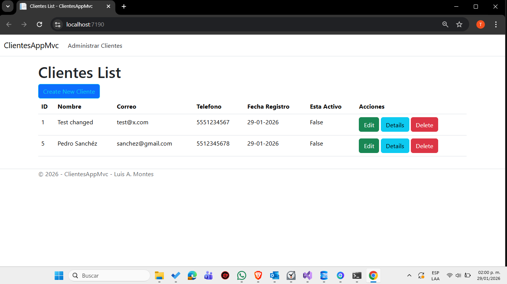
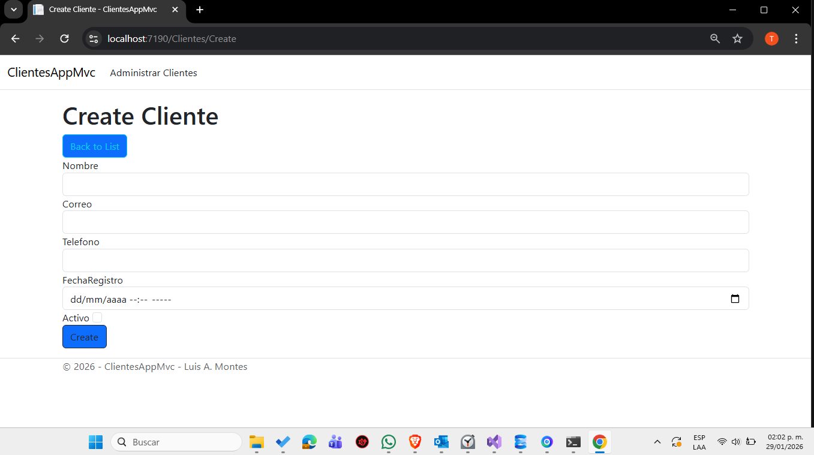
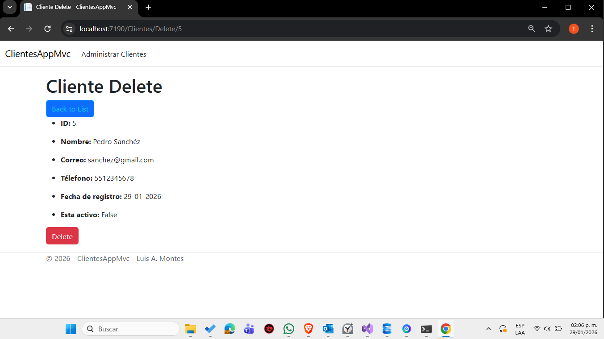
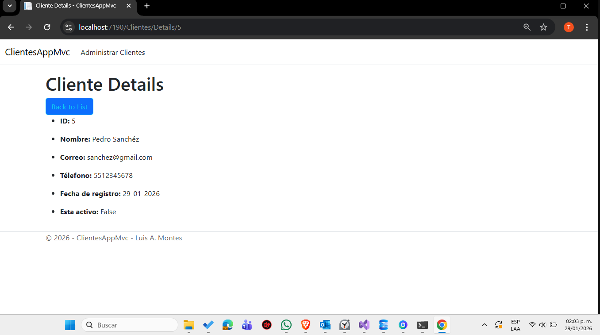
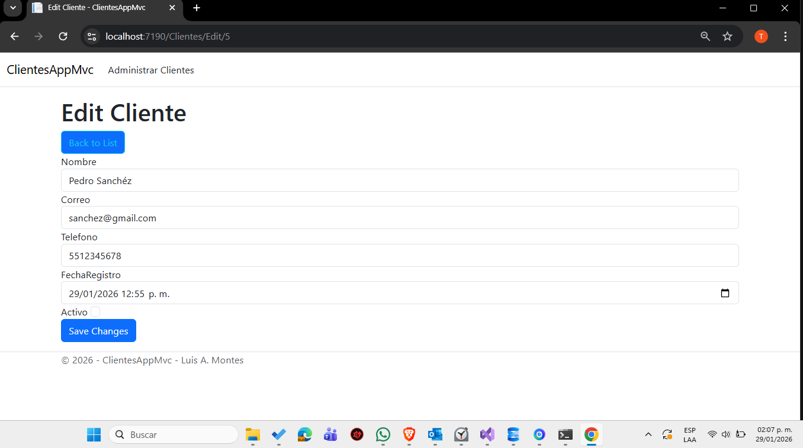

# ClientesAppMvc 29/01/2026
# Luis Angel Montes Bernal
## Descripción
Aplicación web desarrollada en ASP.NET Core MVC para la gestión de clientes.

## Tecnologías
- ASP.NET Core MVC
- C#
- Entity Framework Core
- MSSQLServer
- Razor Views

## Funcionalidades

- Listar clientes
- Crear clientes
- Editar clientes
- Eliminación lógica de clientes
- Validaciones de formulario (Data Annotations)
- Manejo básico de errores

## Arquitectura
- Patrón MVC
- Inyección de dependencias
- Acceso a datos con Entity Framework Core

## Ejecución del proyecto
1. Configurar la cadena de conexión en `appsettings.json`
2. Ejecutar migraciones
3. Ejecutar el proyecto desde Visual Studio

## Estado del proyecto
Proyecto de práctica orientado a portafolio para puesto Junior .NET.

## Contacto
- Email: [Luis Angel Montes Bernal](luismontestrabajo10@gmail.com)
- LinkedIn: [Luis Angel Montes Bernal](https://www.linkedin.com/in/luis-%C3%A1ngel-montes-bernal-2aa2711a3/)

## Capturas de pantalla

